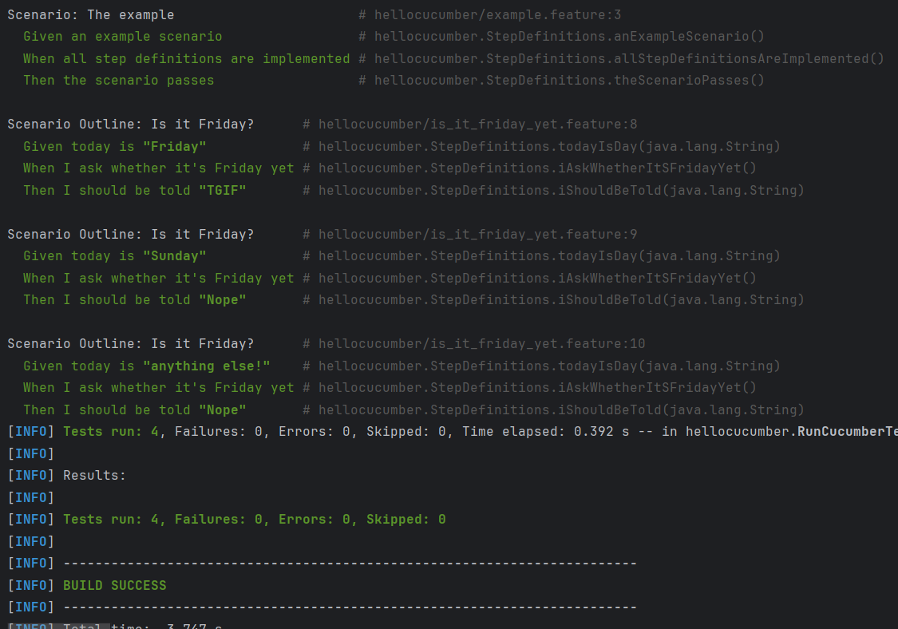
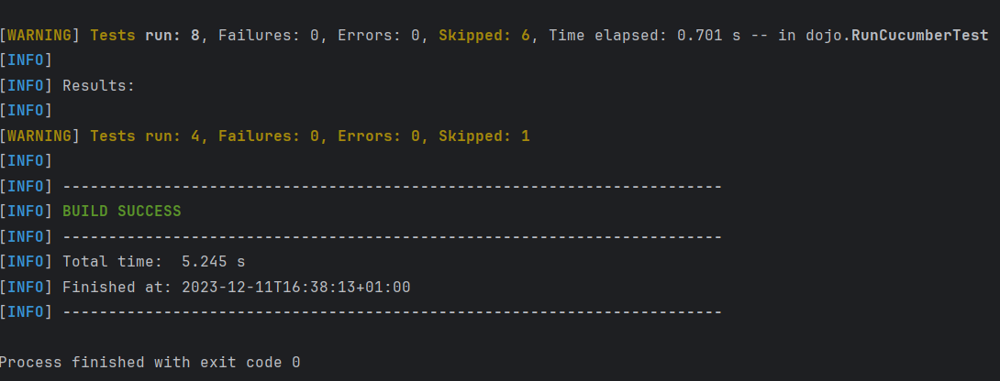

[](https://classroom.github.com/online_ide?assignment_repo_id=13208639&assignment_repo_type=AssignmentRepo)
= R5.A.08 -- Dépôt pour les TPs
:icons: font
:MoSCoW: https://fr.wikipedia.org/wiki/M%C3%A9thode_MoSCoW[MoSCoW]

Ce dépôt concerne les rendus de mailto:A_changer@etu.univ-tlse2.fr[Jonh Doe].

== TP1

is_it_friday_yet.feature
```
Feature: Is it Friday?
  Scenario Outline: Is it Friday?
    Given today is "<day>"
    When I ask whether it's Friday yet
    Then I should be told "<answer>"
    Examples:
      | day            | answer |
      | Friday         | TGIF   |
      | Sunday         | Nope   |
      | anything else! | Nope   |
```


Capture d'écran de l'exécution des tests



== TP2

Order.java
```java
package dojo;

import java.util.ArrayList;
import java.util.List;

public class Order {

    private String owner;
    private String target;
    private List<String> cocktails;

    public String getMessage() {
        return message;
    }

    public void setMessage(String message) {
        this.message = "From "+ owner + " to " + target + ": " + message;
    }

    private String message;

    public Order() {
        cocktails = new ArrayList<>();
    }

    public void declareOwner(String romeo) {
        owner = romeo;
    }

    public void declareTarget(String juliette) {
        target = juliette;
    }

    public List<String> getCocktails() {
        return cocktails;
    }
}
```

